# MLOps by Azure ML Studio in building a forecast model for time deposit subscription

In this project,  use Azure to configure a cloud-based machine learning production model, deploy it, and consume it. and also create, publish, and consume a pipeline

## Architectural Diagram

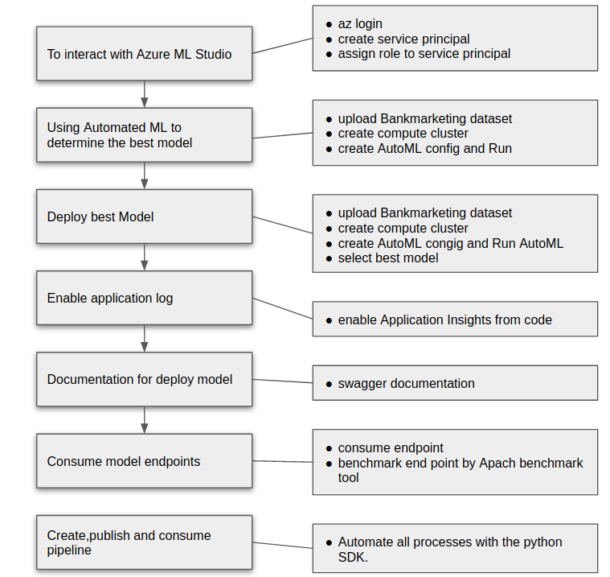 

## Key Steps

 1. To interact with Azure ML Studio

    Create the Service Principal with az after login in
    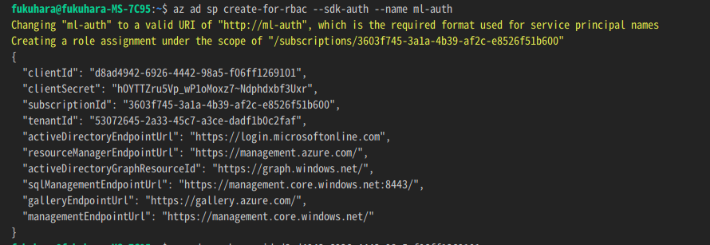
    Capture the "objectId" using the clientID
    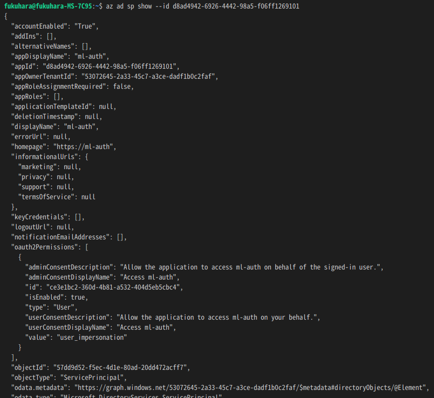
    Assign the role to the new Service Principal for the given Workspace, Resource Group and User objectId  
    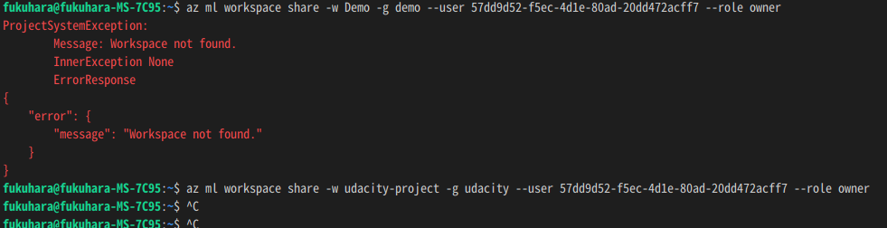

2. Autometed ML Experiment  
    Registered Datasets same Bankmarketing dataset (same as course1)  
    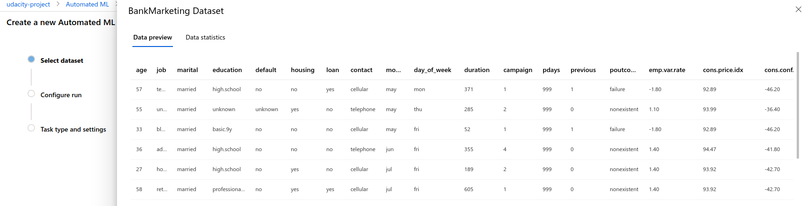
    Experiment completed(same as course1)
    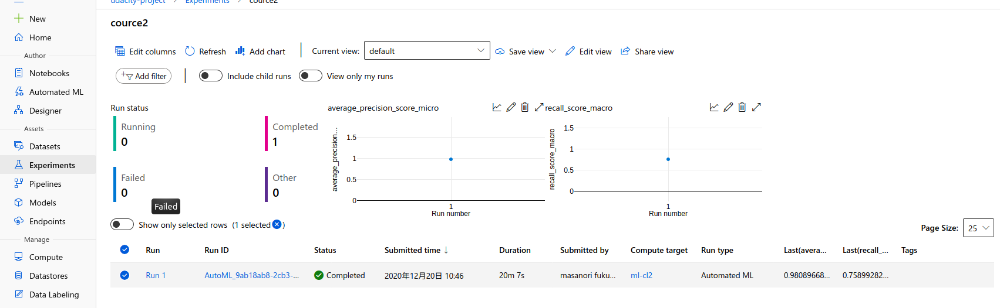
    Best model after experiment complited (same as course1 )
    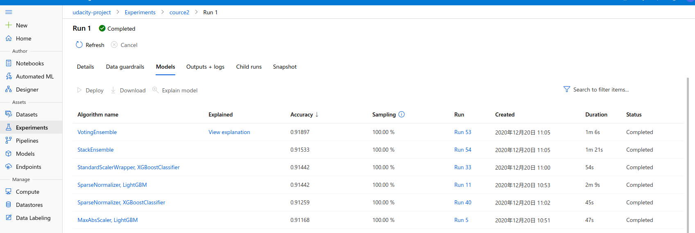

3. Application insight  
    how to enable Application Insights from a deployed model and then produced logging output with the Python SDK. The following command will enable the logging.  
    
    after run script, application insights enabled true
    

4. Swagger Documentation  

    Swagger is a tool that helps build, document, and consume RESTful web services like the ones you are deploying in Azure ML Studio. It further explains what types of HTTP requests that an API can consume, like POST and GET.

    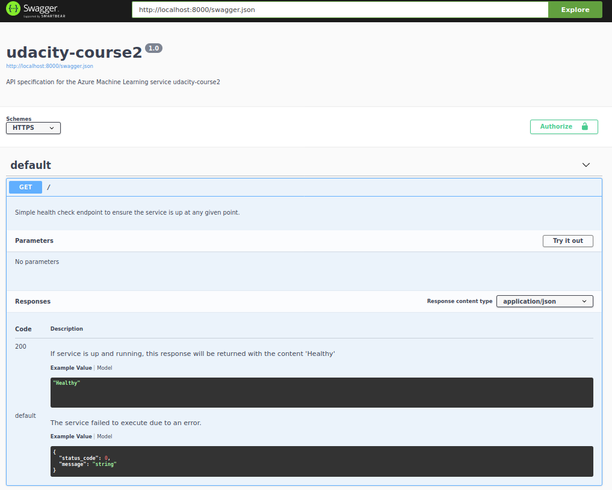
    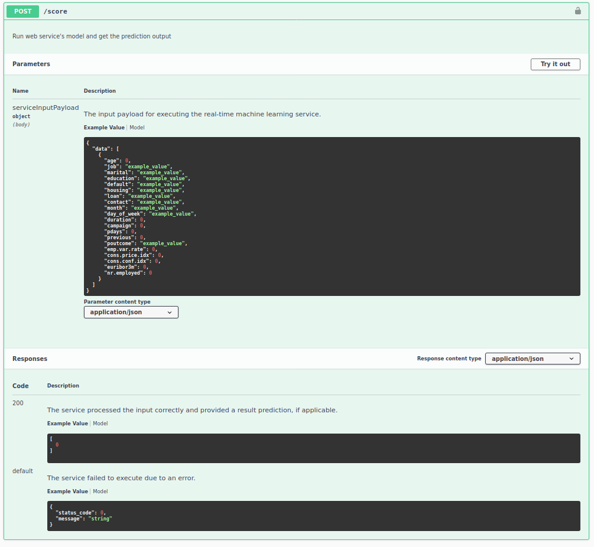

5. Consume model endpoint  
    endpoint.py script provided to interact with the trained model.  
    replace the scoring_uri and key to match the REST endpoint and primary key respectively in endpoint.py.   The script issues a POST request to the deployed model and gets a JSON response that gets printed to the terminal.

    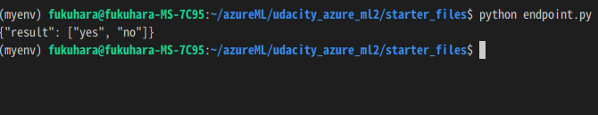

 

  
6. Benchmark endpoint  
    A benchmark is used to create a baseline or acceptable performance measure. Benchmarking HTTP APIs is used to find the average response time for a deployed model.  

    Apache Benchmark is an easy and popular tool for benchmarking HTTP services.  
    Make sure the Apache Benchmark command-line tool installed and available  
    $ ab --help  
    Usage: ab [options] [http[s]://]hostname[:port]/path  

    run the benchmark.sh script  

    

7. Create, Publish and Consume a Pipeline  
    Automate all processes with the Pythnon SDK.

   run notebook after update, pipeline has been created
   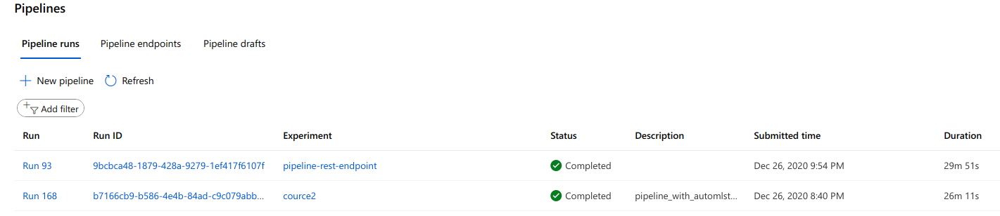
    bankmarketing dataset with the AutoML module
    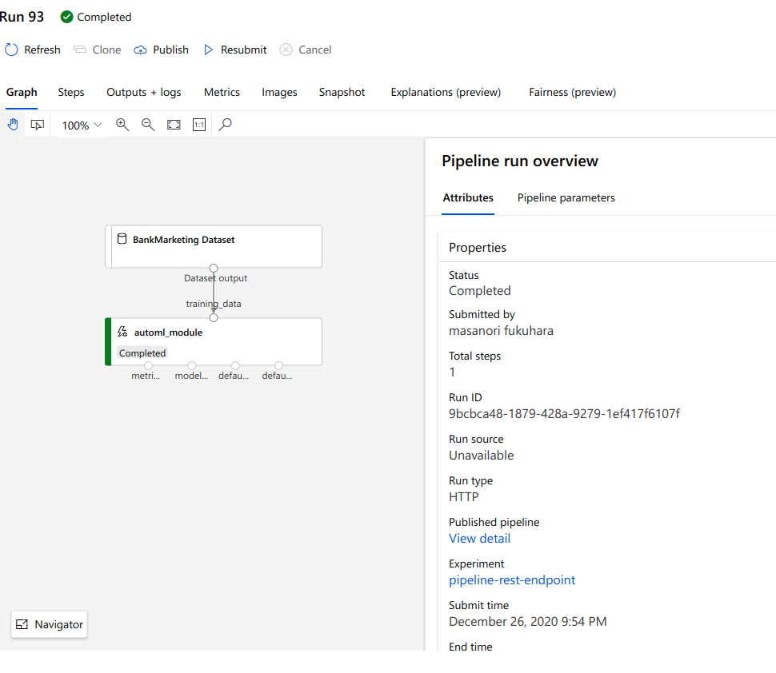
    endpoint in ML studio   
    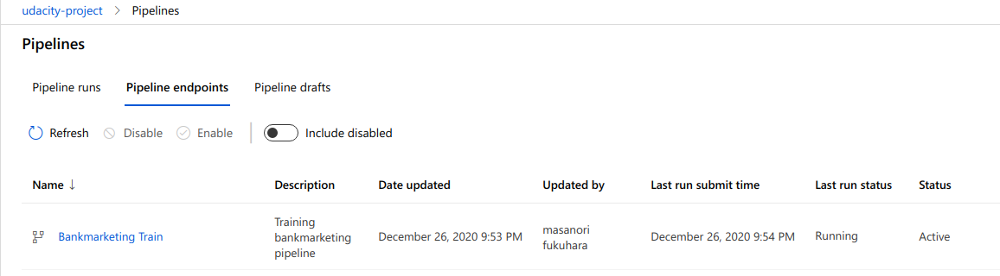
    REST endpoint and status is active
    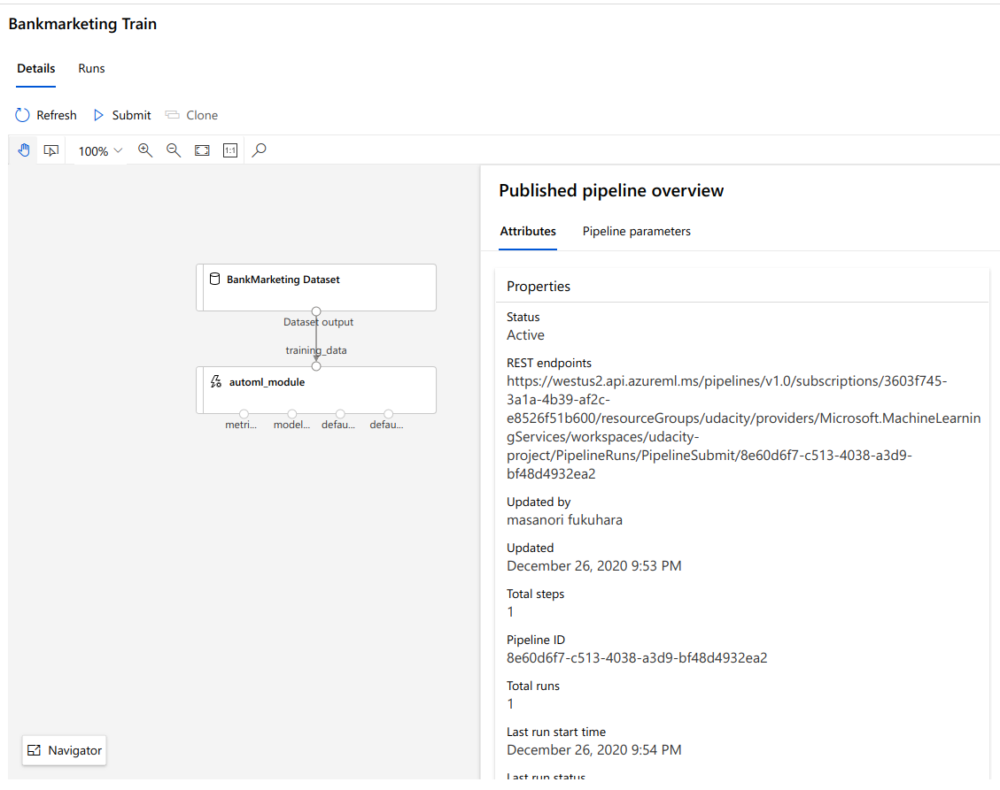
    In ML studio the scheduled run

    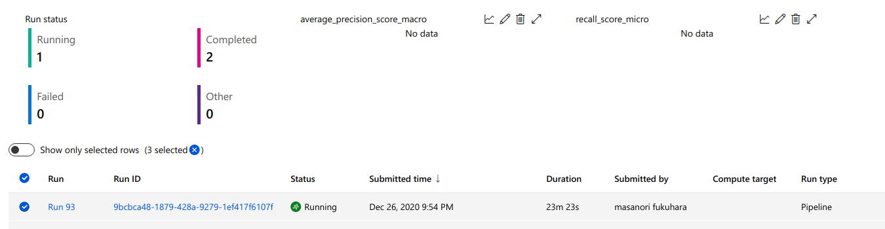

## Screen Recording

<simplescreenrecorder-2020-12-21_00.33.58.mp4>

## Standout Suggestions
*TODO (Optional):* This is where you can provide information about any standout suggestions that you have attempted.
