# MLOps by Azure ML Studio in building a forecast model for time deposit subscription

This project uses Azure to practice MLOps, which automates the machine learning process. Use AutoML to explore the best models, deploy them, publish them, and build a working stream. Finally, we will fully automate the construction and publication of pipelines using the Python SDK.

## how to improve the project in the future
The freshness of the forecast model is important because joining a time deposit is susceptible to the effects of the economy and financial markets. It is necessary to monitor the data drift and update the model without overlooking the timing of the model update. Implementing a model update trigger function that is linked to the data monitoring process and monitoring thresholds is an effective means.

## Architectural Diagram

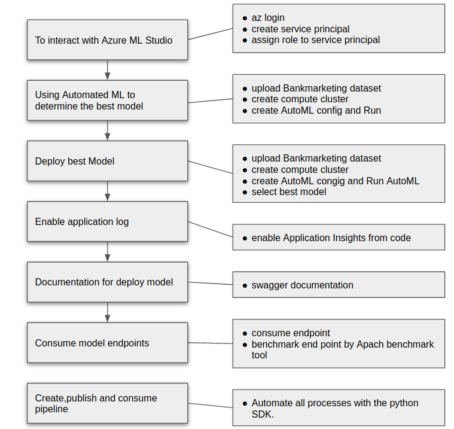 

## Key Steps

 1. To interact with Azure ML Studio

    Create the Service Principal with az after login in
    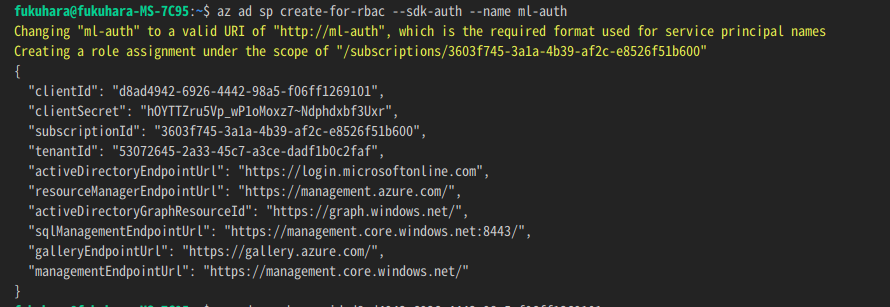
    Capture the "objectId" using the clientID
    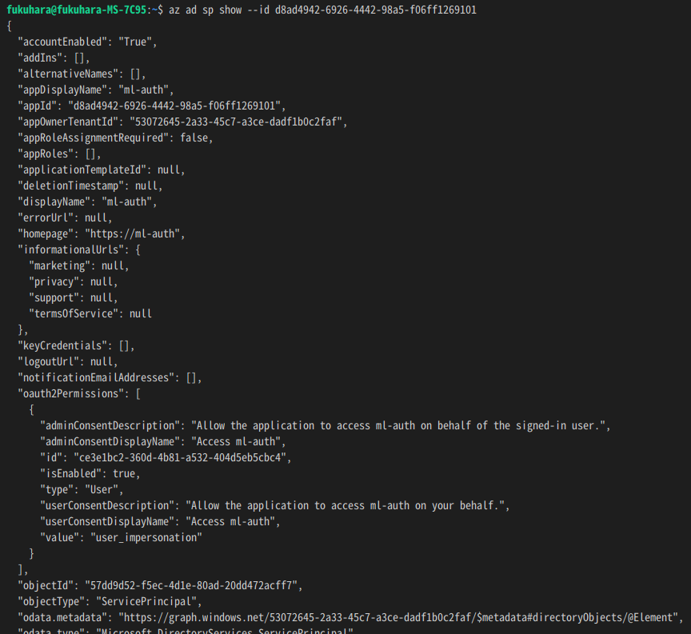
    Assign the role to the new Service Principal for the given Workspace, Resource Group and User objectId  
    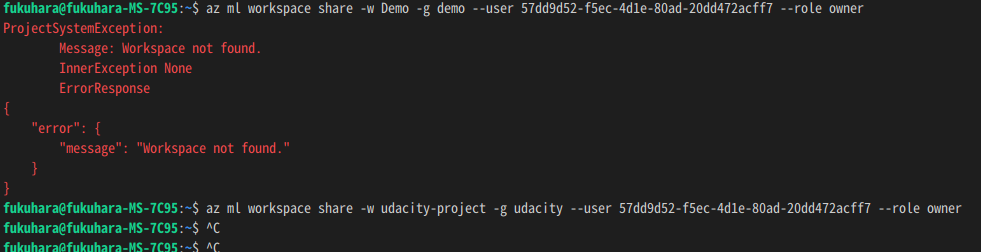

2. Autometed ML Experiment  
    Registered Datasets same Bankmarketing dataset (same as course1)  
    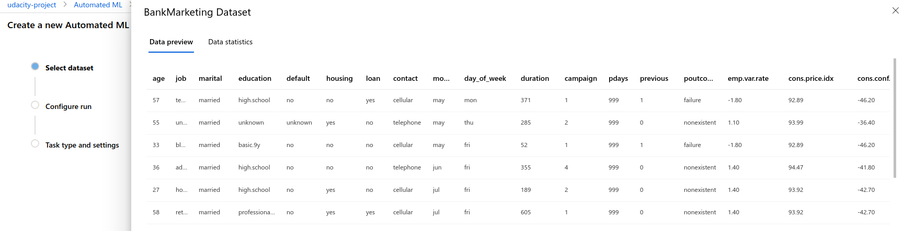
    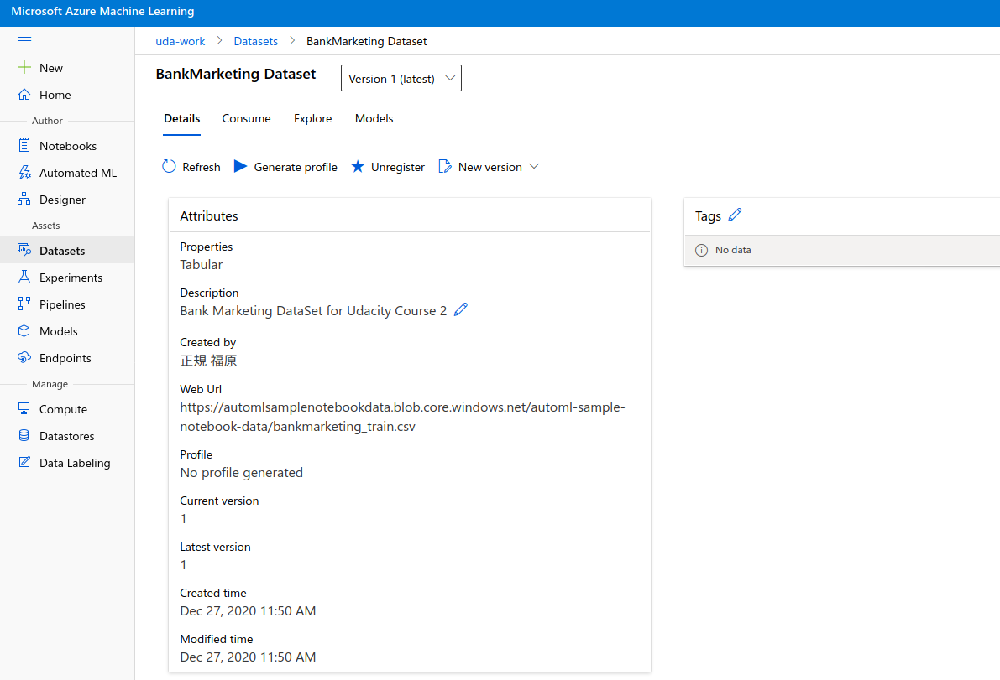
    Experiment completed(same as course1)
    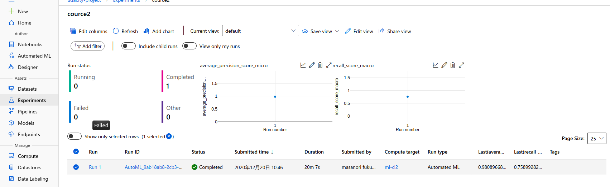
    Best model after experiment complited (same as course1 )
    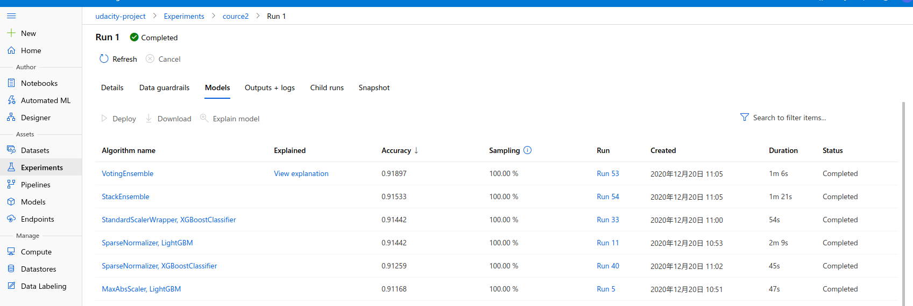

3. Application insight  
    how to enable Application Insights from a deployed model and then produced logging output with the Python SDK. The following command will enable the logging.  
    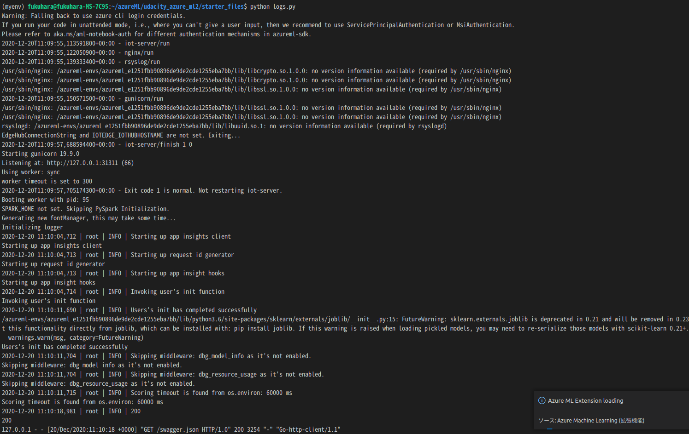
    after run script, application insights enabled true
    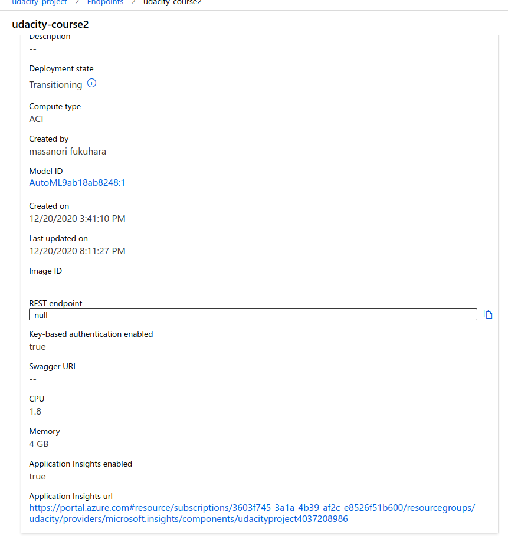

4. Swagger Documentation  

    Swagger is a tool that helps build, document, and consume RESTful web services like the ones you are deploying in Azure ML Studio. It further explains what types of HTTP requests that an API can consume, like POST and GET.

    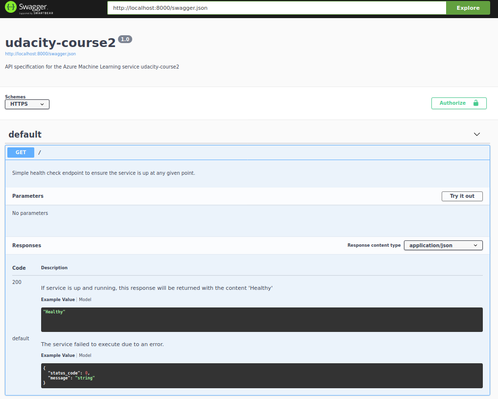
    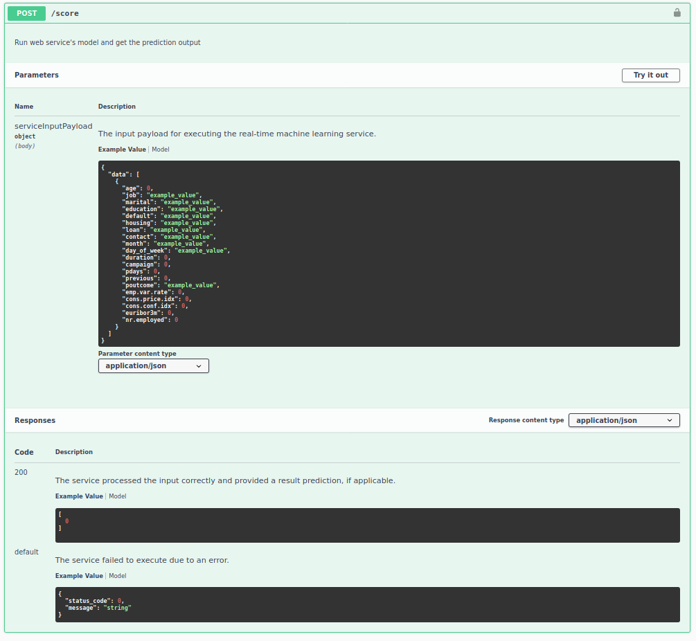

5. Consume model endpoint  
    endpoint.py script provided to interact with the trained model.  
    replace the scoring_uri and key to match the REST endpoint and primary key respectively in endpoint.py.   The script issues a POST request to the deployed model and gets a JSON response that gets printed to the terminal.

    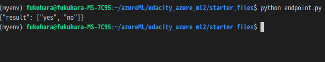

 

  
6. Benchmark endpoint  
    A benchmark is used to create a baseline or acceptable performance measure. Benchmarking HTTP APIs is used to find the average response time for a deployed model.  

    Apache Benchmark is an easy and popular tool for benchmarking HTTP services.  
    Make sure the Apache Benchmark command-line tool installed and available  
    $ ab --help  
    Usage: ab [options] [http[s]://]hostname[:port]/path  

    run the benchmark.sh script  

    

7. Create, Publish and Consume a Pipeline  
    Automate all processes with the Pythnon SDK.

   run notebook after update, pipeline has been created
   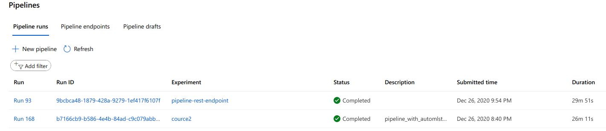
    bankmarketing dataset with the AutoML module
    
    endpoint in ML studio   
    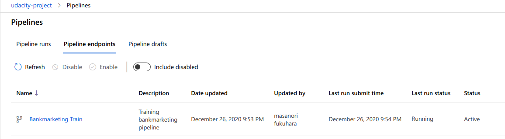
    REST endpoint and status is active
    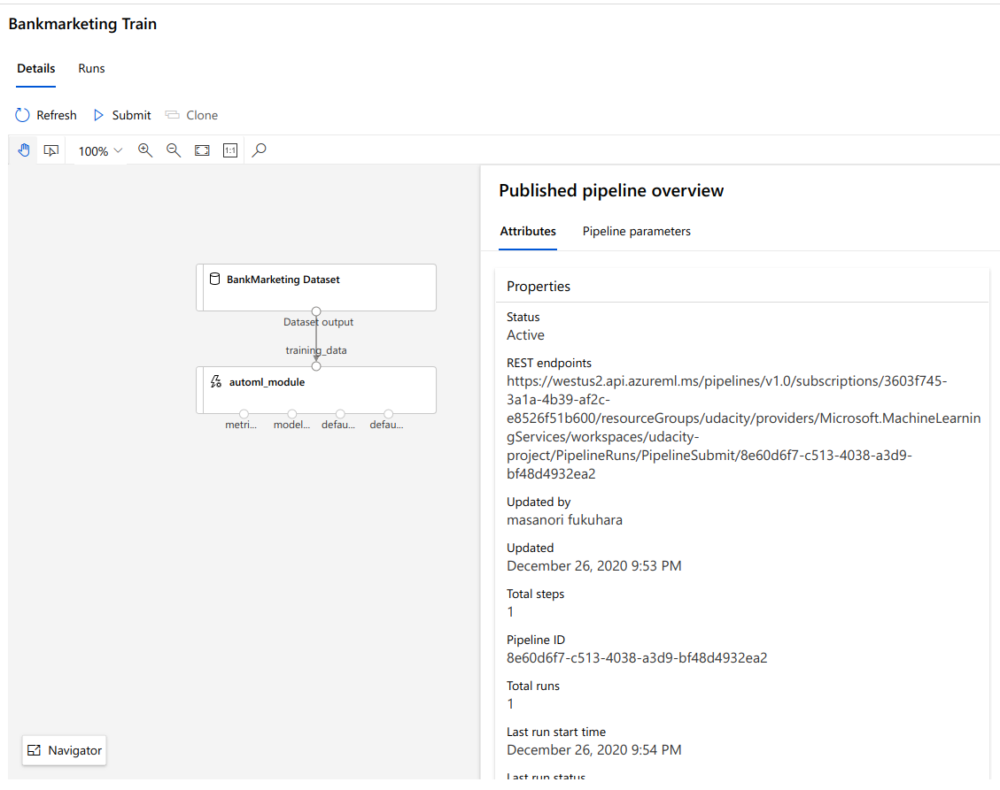
    In ML studio the scheduled run

    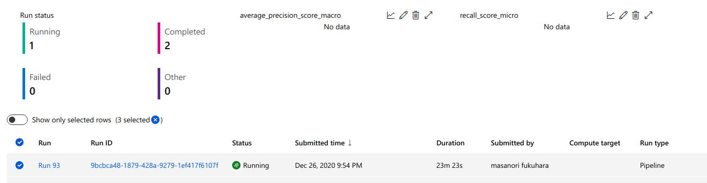
    Use RunDetails Widget” with the step runs  
    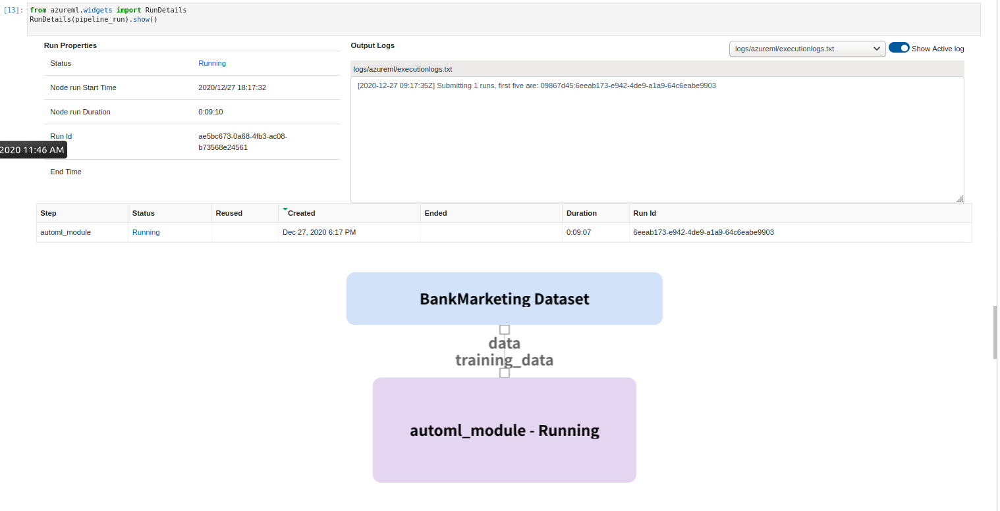

## Screen Recording
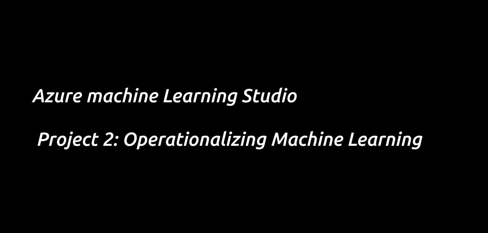(udacity2.mp4)

## Standout Suggestions
*TODO (Optional):* This is where you can provide information about any standout suggestions that you have attempted.
